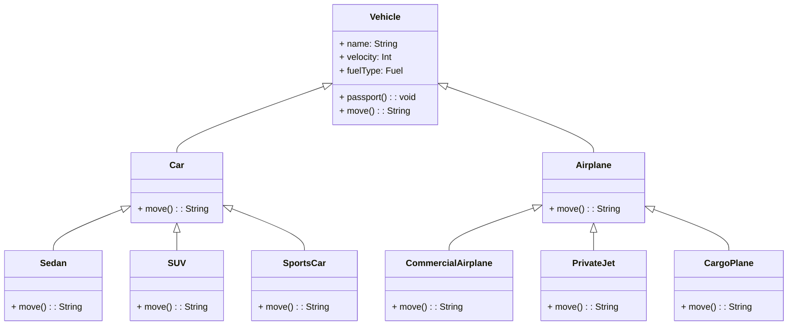

## Иерархия классов

## Пользовательский интерфейс

1. Меню выбора действия:
* Создать автомобиль
* Создать самолет
* Выйти
2. Создание автомобиля (Car):
* Имя
* Скорость
* Тип топлива
3. Создание самолета (Airplane):
* Имя
* Скорость
* Тип топлива
4. Отображение результатов:
* Информация о созданном объекте
5. Выйти (Exit):
* Завершение программы